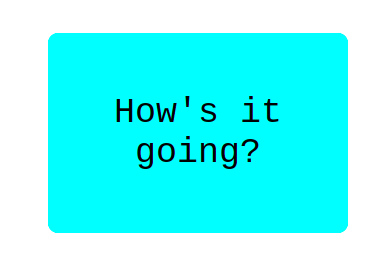

# Hello React Front End
- API created with [ruby on rails](https://github.com/ahmetbozaci/hello-rails-backendv2)
- When page refresh page shows random greeting from API that include 5 different greeting.
  

## Built With

- React
- Redux

## Setup
```
- $ git clone https://github.com/ahmetbozaci/hello-react-frontendv2.git
- $ cd hello-react-frontendv2
```

```
- $ npm install
```
```
- $ npm start
```
## Authors

👤 **Ahmet Bozacı**
- Github:[ ahmetbozaci](https://github.com/ahmetbozaci)
- Twitter:[ ahmtbozaci](https://twitter.com/ahmtbozaci)
- LinkedIn:[ ahmetbozaci](https://www.linkedin.com/in/ahmetbozaci/)

## 🤝 Contributing

Contributions, issues, and feature requests are welcome!

Feel free to check the [issues page](../../issues/).

## Show your support

Give a ⭐️ if you like this project!

